# PrepQuest — Workflow, Features, and System Diagrams

This document describes the current PrepQuest MVP as implemented in the repository. It covers the user experience, feature relationships, navigation, application startup, state changes, persistence, derived metrics, and important business rules.

All diagrams use Mermaid and can be rendered by GitHub, GitLab, Mermaid Live Editor, VS Code Mermaid extensions, and other Mermaid-compatible Markdown viewers.

## Contents

1. [Product scope](#1-product-scope)
2. [System context](#2-system-context)
3. [Feature map](#3-feature-map)
4. [User-story map](#4-user-story-map)
5. [Navigation and information architecture](#5-navigation-and-information-architecture)
6. [End-to-end user workflow](#6-end-to-end-user-workflow)
7. [User journey](#7-user-journey)
8. [Application startup sequence](#8-application-startup-sequence)
9. [Exam-selection sequence](#9-exam-selection-sequence)
10. [Syllabus-tracking sequence](#10-syllabus-tracking-sequence)
11. [Daily-study-log sequence](#11-daily-study-log-sequence)
12. [Settings and reset sequences](#12-settings-and-reset-sequences)
13. [Progress and analytics calculation flow](#13-progress-and-analytics-calculation-flow)
14. [Streak calculation flow](#14-streak-calculation-flow)
15. [XP and level calculation flow](#15-xp-and-level-calculation-flow)
16. [Application architecture](#16-application-architecture)
17. [Data model](#17-data-model)
18. [Local persistence layout](#18-local-persistence-layout)
19. [Application state lifecycle](#19-application-state-lifecycle)
20. [Feature-to-code traceability](#20-feature-to-code-traceability)
21. [Rules, edge cases, and MVP boundaries](#21-rules-edge-cases-and-mvp-boundaries)

---

## 1. Product scope

PrepQuest is an offline-first Flutter productivity app for Indian competitive-exam aspirants. The current built-in exam catalog includes UPSC, JPSC, and RBI Grade B.

| Capability | Current behavior |
|---|---|
| Profile | A local display name; defaults to `Aspirant` |
| Exam selection | One active exam at a time from the built-in catalog |
| Syllabus tracking | Per-topic completion, grouped by subject |
| Daily tracking | Study hours and completed tasks for the current local date |
| Progress | Syllabus percentage, completed topics, hours, tasks, active days, and consistency |
| Motivation | Current streak, XP, level, and progress to the next level |
| Appearance | Persistent light/dark theme toggle; dark is the default |
| Storage | One local Hive box on the device |
| Identity and sync | No login, account, server, cloud sync, or multi-device sync |

### Built-in exam configuration

| Exam | Subjects | Topics | Daily hours target | Daily task target |
|---|---:|---:|---:|---:|
| UPSC | 5 | 25 | 6 | 5 |
| JPSC | 4 | 20 | 5 | 4 |
| RBI Grade B | 4 | 20 | 4 | 4 |

If no exam is selected, fallback daily targets are 4 hours and 4 tasks. Syllabus progress remains zero until an exam is selected.

---

## 2. System context

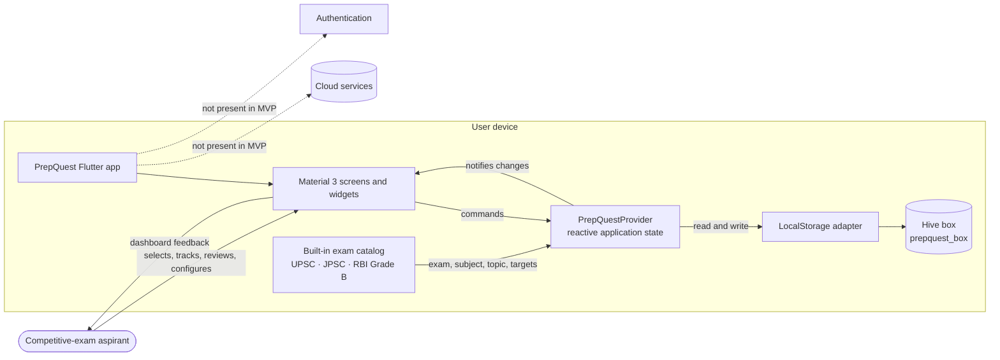
```mermaid
flowchart LR
    User([Competitive-exam aspirant])

    subgraph Device["User device"]
        App["PrepQuest Flutter app"]
        UI["Material 3 screens and widgets"]
        State["PrepQuestProvider\nreactive application state"]
        Catalog["Built-in exam catalog\nUPSC · JPSC · RBI Grade B"]
        Storage["LocalStorage adapter"]
        Hive[("Hive box\nprepquest_box")]

        App --> UI
        UI -->|"commands"| State
        State -->|"notifies changes"| UI
        Catalog -->|"exam, subject, topic, targets"| State
        State -->|"read and write"| Storage
        Storage --> Hive
    end

    User -->|"selects, tracks, reviews, configures"| UI
    UI -->|"dashboard feedback"| User

    Cloud[("Cloud services")]
    Auth["Authentication"]
    App -. "not present in MVP" .-> Cloud
    App -. "not present in MVP" .-> Auth
```

The device is the complete system boundary for the MVP. All writes are local, and all dashboard values are calculated on demand from provider state.

---

## 3. Feature map

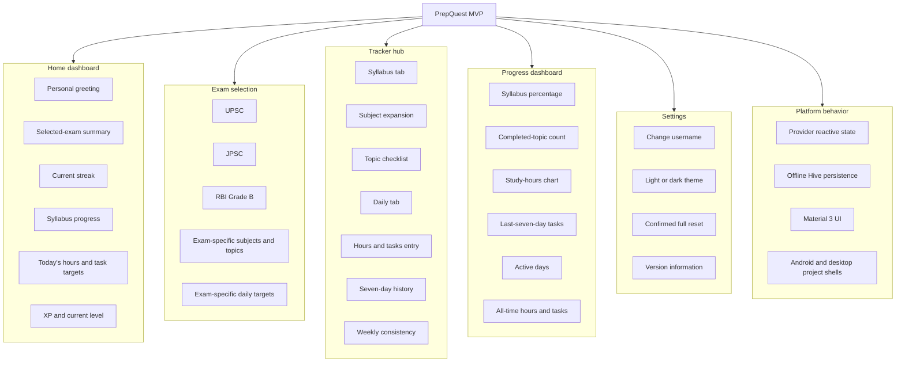
```mermaid
flowchart TB
    Product["PrepQuest MVP"]

    Product --> Home
    Product --> Exams
    Product --> Trackers
    Product --> Dashboard
    Product --> Settings
    Product --> Platform

    subgraph Home["Home dashboard"]
        H1["Personal greeting"]
        H2["Selected-exam summary"]
        H3["Current streak"]
        H4["Syllabus progress"]
        H5["Today's hours and task targets"]
        H6["XP and current level"]
    end

    subgraph Exams["Exam selection"]
        E1["UPSC"]
        E2["JPSC"]
        E3["RBI Grade B"]
        E4["Exam-specific subjects and topics"]
        E5["Exam-specific daily targets"]
    end

    subgraph Trackers["Tracker hub"]
        T1["Syllabus tab"]
        T2["Subject expansion"]
        T3["Topic checklist"]
        T4["Daily tab"]
        T5["Hours and tasks entry"]
        T6["Seven-day history"]
        T7["Weekly consistency"]
    end

    subgraph Dashboard["Progress dashboard"]
        D1["Syllabus percentage"]
        D2["Completed-topic count"]
        D3["Study-hours chart"]
        D4["Last-seven-day tasks"]
        D5["Active days"]
        D6["All-time hours and tasks"]
    end

    subgraph Settings["Settings"]
        S1["Change username"]
        S2["Light or dark theme"]
        S3["Confirmed full reset"]
        S4["Version information"]
    end

    subgraph Platform["Platform behavior"]
        P1["Provider reactive state"]
        P2["Offline Hive persistence"]
        P3["Material 3 UI"]
        P4["Android and desktop project shells"]
    end
```

---

## 4. User-story map

The following diagram expresses the implemented behavior as user stories, grouped by the user's goal.

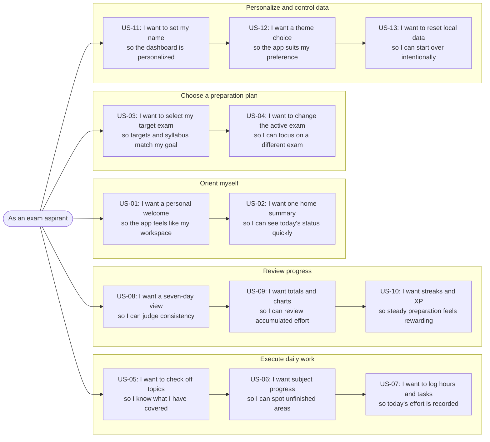
```mermaid
flowchart LR
    Actor(["As an exam aspirant"])

    subgraph Orient["Orient myself"]
        US01["US-01: I want a personal welcome\nso the app feels like my workspace"]
        US02["US-02: I want one home summary\nso I can see today's status quickly"]
    end

    subgraph Plan["Choose a preparation plan"]
        US03["US-03: I want to select my target exam\nso targets and syllabus match my goal"]
        US04["US-04: I want to change the active exam\nso I can focus on a different exam"]
    end

    subgraph Execute["Execute daily work"]
        US05["US-05: I want to check off topics\nso I know what I have covered"]
        US06["US-06: I want subject progress\nso I can spot unfinished areas"]
        US07["US-07: I want to log hours and tasks\nso today's effort is recorded"]
    end

    subgraph Review["Review progress"]
        US08["US-08: I want a seven-day view\nso I can judge consistency"]
        US09["US-09: I want totals and charts\nso I can review accumulated effort"]
        US10["US-10: I want streaks and XP\nso steady preparation feels rewarding"]
    end

    subgraph Personalize["Personalize and control data"]
        US11["US-11: I want to set my name\nso the dashboard is personalized"]
        US12["US-12: I want a theme choice\nso the app suits my preference"]
        US13["US-13: I want to reset local data\nso I can start over intentionally"]
    end

    Actor --> US01
    Actor --> US03
    Actor --> US05
    Actor --> US08
    Actor --> US11

    US01 --> US02
    US03 --> US04
    US05 --> US06 --> US07
    US08 --> US09 --> US10
    US11 --> US12 --> US13
```

### Story dependency view

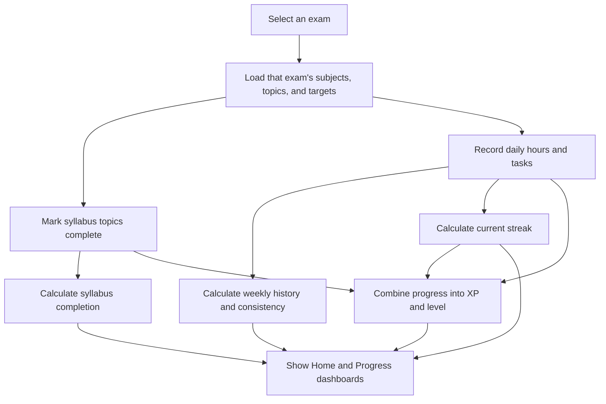
```mermaid
flowchart TD
    Select["Select an exam"]
    Catalog["Load that exam's subjects, topics, and targets"]
    Topics["Mark syllabus topics complete"]
    Daily["Record daily hours and tasks"]
    Syllabus["Calculate syllabus completion"]
    Weekly["Calculate weekly history and consistency"]
    Streak["Calculate current streak"]
    XP["Combine progress into XP and level"]
    Summary["Show Home and Progress dashboards"]

    Select --> Catalog
    Catalog --> Topics
    Catalog --> Daily
    Topics --> Syllabus
    Topics --> XP
    Daily --> Weekly
    Daily --> Streak
    Daily --> XP
    Streak --> XP
    Syllabus --> Summary
    Weekly --> Summary
    Streak --> Summary
    XP --> Summary
```

---

## 5. Navigation and information architecture

`PrepQuestShell` keeps all five primary pages alive in an `IndexedStack`. Changing a bottom-navigation destination changes the visible index; it does not create a new route.

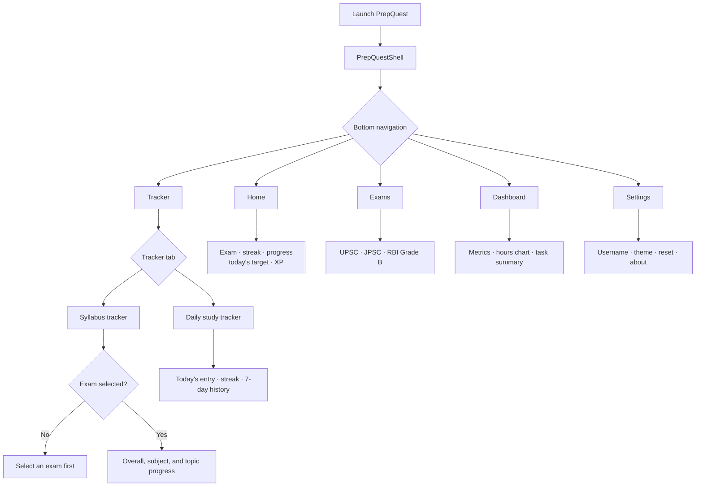
```mermaid
flowchart TD
    Launch["Launch PrepQuest"] --> Shell["PrepQuestShell"]

    Shell --> Nav{"Bottom navigation"}
    Nav --> Home["Home"]
    Nav --> Exams["Exams"]
    Nav --> Tracker["Tracker"]
    Nav --> Progress["Dashboard"]
    Nav --> Settings["Settings"]

    Tracker --> Tabs{"Tracker tab"}
    Tabs --> Syllabus["Syllabus tracker"]
    Tabs --> Daily["Daily study tracker"]

    Home --> HomeContent["Exam · streak · progress\ntoday's target · XP"]
    Exams --> ExamCards["UPSC · JPSC · RBI Grade B"]
    Syllabus --> ExamCheck{"Exam selected?"}
    ExamCheck -->|"No"| EmptyState["Select an exam first"]
    ExamCheck -->|"Yes"| Checklist["Overall, subject, and topic progress"]
    Daily --> DailyContent["Today's entry · streak · 7-day history"]
    Progress --> ProgressContent["Metrics · hours chart · task summary"]
    Settings --> SettingsContent["Username · theme · reset · about"]
```

### Screen inventory

| Destination | Primary purpose | Can mutate state? | Empty or fallback behavior |
|---|---|---:|---|
| Home | At-a-glance preparation status | No | Prompts user to choose an exam; targets use 4h/4 tasks |
| Exams | Select the active exam | Yes | All built-in exams remain available |
| Tracker → Syllabus | Complete topics and inspect subject progress | Yes | Dedicated no-exam state |
| Tracker → Daily | Save today's hours and tasks | Yes | Works even without an exam, using fallback targets |
| Dashboard | Review progress, history, and totals | No | Exam-specific metrics show zero or explanatory labels |
| Settings | Change local preferences or clear data | Yes | Username/theme use stored defaults |

---

## 6. End-to-end user workflow

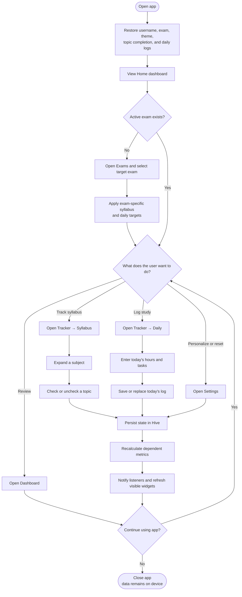
```mermaid
flowchart TD
    Start(["Open app"])
    Restore["Restore username, exam, theme,\ntopic completion, and daily logs"]
    Home["View Home dashboard"]
    HasExam{"Active exam exists?"}
    Choose["Open Exams and select target exam"]
    Apply["Apply exam-specific syllabus\nand daily targets"]
    Activity{"What does the user want to do?"}
    TrackTopic["Open Tracker → Syllabus"]
    Expand["Expand a subject"]
    Toggle["Check or uncheck a topic"]
    LogStudy["Open Tracker → Daily"]
    Enter["Enter today's hours and tasks"]
    Save["Save or replace today's log"]
    Review["Open Dashboard"]
    Configure["Open Settings"]
    Persist["Persist state in Hive"]
    Recalculate["Recalculate dependent metrics"]
    Refresh["Notify listeners and refresh visible widgets"]
    Continue{"Continue using app?"}
    End(["Close app\ndata remains on device"])

    Start --> Restore --> Home --> HasExam
    HasExam -->|"No"| Choose --> Apply --> Activity
    HasExam -->|"Yes"| Activity

    Activity -->|"Track syllabus"| TrackTopic --> Expand --> Toggle --> Persist
    Activity -->|"Log study"| LogStudy --> Enter --> Save --> Persist
    Activity -->|"Review"| Review --> Continue
    Activity -->|"Personalize or reset"| Configure --> Persist

    Persist --> Recalculate --> Refresh --> Continue
    Continue -->|"Yes"| Activity
    Continue -->|"No"| End
```

---

## 7. User journey

This journey focuses on the typical first session. Scores indicate the expected clarity or satisfaction of each step on a 1–5 scale; they are documentation annotations, not analytics collected by the app.

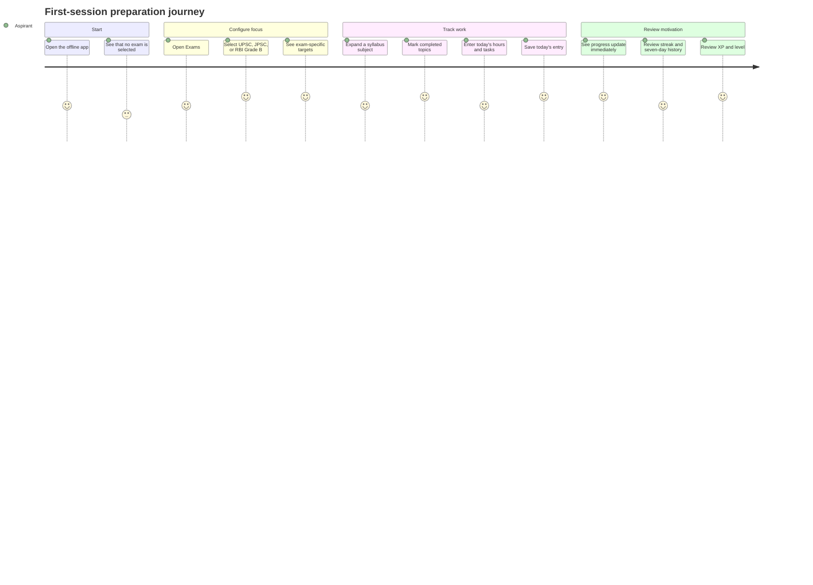
```mermaid
journey
    title First-session preparation journey
    section Start
      Open the offline app: 4: Aspirant
      See that no exam is selected: 3: Aspirant
    section Configure focus
      Open Exams: 4: Aspirant
      Select UPSC, JPSC, or RBI Grade B: 5: Aspirant
      See exam-specific targets: 5: Aspirant
    section Track work
      Expand a syllabus subject: 4: Aspirant
      Mark completed topics: 5: Aspirant
      Enter today's hours and tasks: 4: Aspirant
      Save today's entry: 5: Aspirant
    section Review motivation
      See progress update immediately: 5: Aspirant
      Review streak and seven-day history: 4: Aspirant
      Review XP and level: 5: Aspirant
```

---

## 8. Application startup sequence

The UI is not started until Hive is initialized, the box is open, and saved state has been loaded into `PrepQuestProvider`.

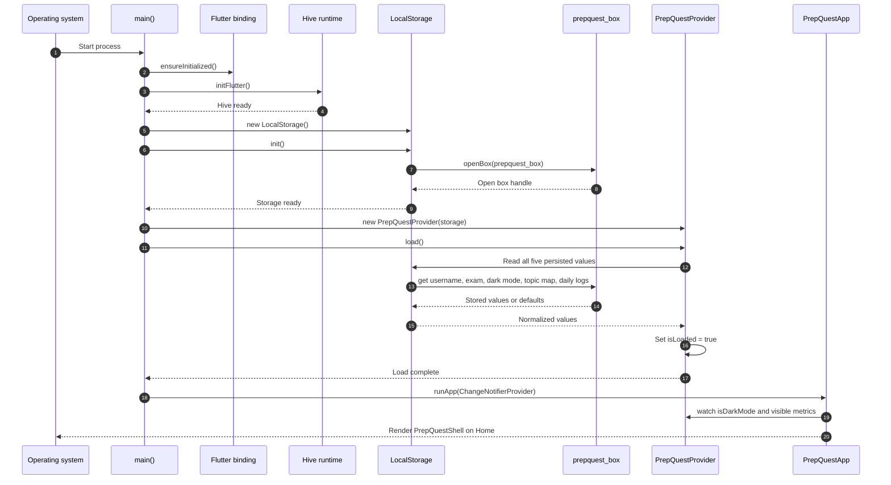
```mermaid
sequenceDiagram
    autonumber
    participant OS as Operating system
    participant Main as main()
    participant Flutter as Flutter binding
    participant Hive as Hive runtime
    participant Store as LocalStorage
    participant DB as prepquest_box
    participant Provider as PrepQuestProvider
    participant UI as PrepQuestApp

    OS->>Main: Start process
    Main->>Flutter: ensureInitialized()
    Main->>Hive: initFlutter()
    Hive-->>Main: Hive ready
    Main->>Store: new LocalStorage()
    Main->>Store: init()
    Store->>DB: openBox(prepquest_box)
    DB-->>Store: Open box handle
    Store-->>Main: Storage ready
    Main->>Provider: new PrepQuestProvider(storage)
    Main->>Provider: load()
    Provider->>Store: Read all five persisted values
    Store->>DB: get username, exam, dark mode, topic map, daily logs
    DB-->>Store: Stored values or defaults
    Store-->>Provider: Normalized values
    Provider->>Provider: Set isLoaded = true
    Provider-->>Main: Load complete
    Main->>UI: runApp(ChangeNotifierProvider)
    UI->>Provider: watch isDarkMode and visible metrics
    UI-->>OS: Render PrepQuestShell on Home
```

### Startup defaults

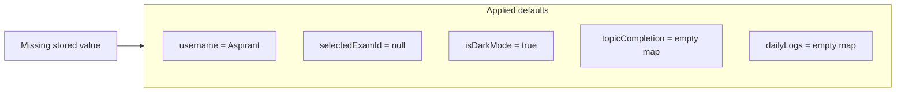
```mermaid
flowchart LR
    Missing["Missing stored value"] --> Defaults

    subgraph Defaults["Applied defaults"]
        U["username = Aspirant"]
        E["selectedExamId = null"]
        T["isDarkMode = true"]
        C["topicCompletion = empty map"]
        L["dailyLogs = empty map"]
    end
```

---

## 9. Exam-selection sequence

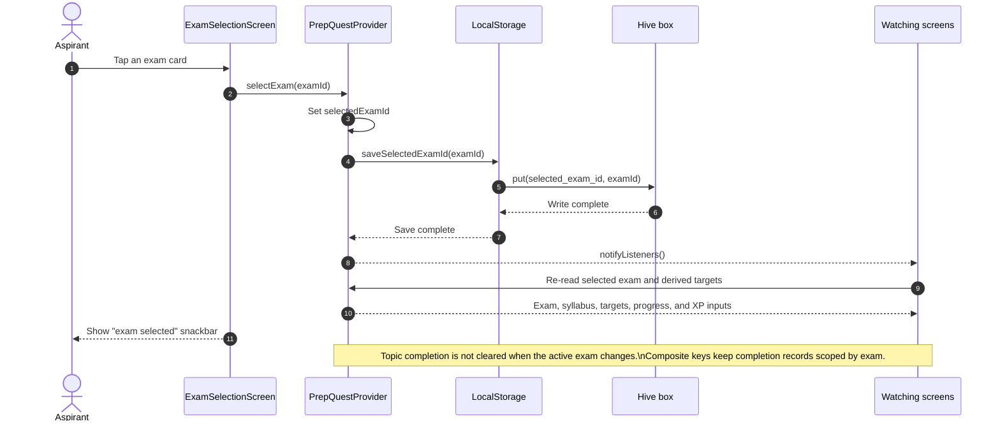
```mermaid
sequenceDiagram
    autonumber
    actor User as Aspirant
    participant Screen as ExamSelectionScreen
    participant Provider as PrepQuestProvider
    participant Store as LocalStorage
    participant Hive as Hive box
    participant Views as Watching screens

    User->>Screen: Tap an exam card
    Screen->>Provider: selectExam(examId)
    Provider->>Provider: Set selectedExamId
    Provider->>Store: saveSelectedExamId(examId)
    Store->>Hive: put(selected_exam_id, examId)
    Hive-->>Store: Write complete
    Store-->>Provider: Save complete
    Provider-->>Views: notifyListeners()
    Views->>Provider: Re-read selected exam and derived targets
    Provider-->>Views: Exam, syllabus, targets, progress, and XP inputs
    Screen-->>User: Show "exam selected" snackbar

    Note over Provider,Views: Topic completion is not cleared when the active exam changes.\nComposite keys keep completion records scoped by exam.
```

Changing the active exam changes which syllabus and topic-completion records contribute to `completedTopicCount`, `syllabusProgress`, and topic-derived XP. Daily logs remain shared because they are keyed only by date.

---

## 10. Syllabus-tracking sequence

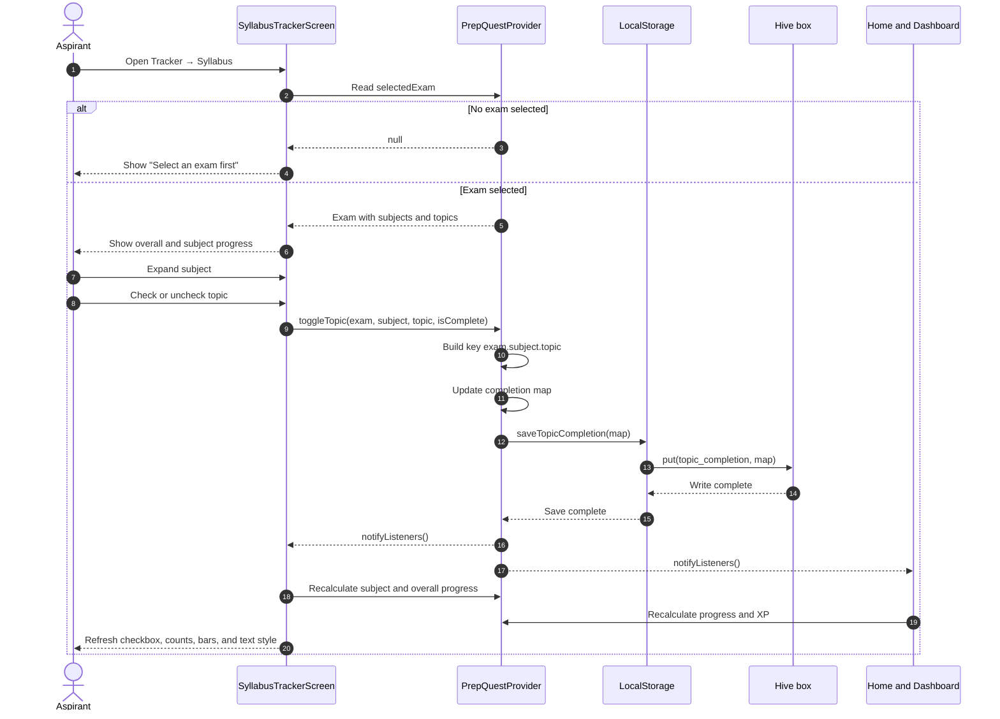
```mermaid
sequenceDiagram
    autonumber
    actor User as Aspirant
    participant UI as SyllabusTrackerScreen
    participant Provider as PrepQuestProvider
    participant Store as LocalStorage
    participant Hive as Hive box
    participant Dashboards as Home and Dashboard

    User->>UI: Open Tracker → Syllabus
    UI->>Provider: Read selectedExam
    alt No exam selected
        Provider-->>UI: null
        UI-->>User: Show "Select an exam first"
    else Exam selected
        Provider-->>UI: Exam with subjects and topics
        UI-->>User: Show overall and subject progress
        User->>UI: Expand subject
        User->>UI: Check or uncheck topic
        UI->>Provider: toggleTopic(exam, subject, topic, isComplete)
        Provider->>Provider: Build key exam.subject.topic
        Provider->>Provider: Update completion map
        Provider->>Store: saveTopicCompletion(map)
        Store->>Hive: put(topic_completion, map)
        Hive-->>Store: Write complete
        Store-->>Provider: Save complete
        Provider-->>UI: notifyListeners()
        Provider-->>Dashboards: notifyListeners()
        UI->>Provider: Recalculate subject and overall progress
        Dashboards->>Provider: Recalculate progress and XP
        UI-->>User: Refresh checkbox, counts, bars, and text style
    end
```

### Topic completion key

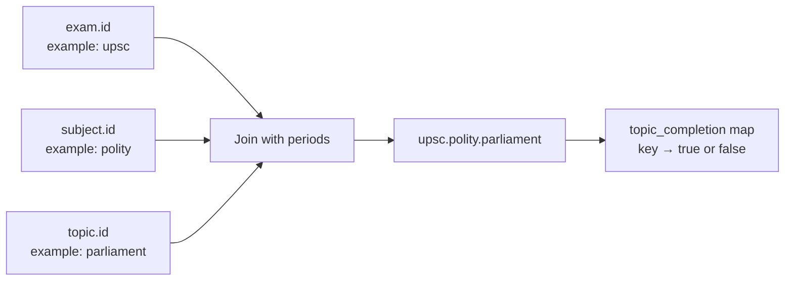
```mermaid
flowchart LR
    Exam["exam.id\nexample: upsc"] --> Join["Join with periods"]
    Subject["subject.id\nexample: polity"] --> Join
    Topic["topic.id\nexample: parliament"] --> Join
    Join --> Key["upsc.polity.parliament"]
    Key --> Map["topic_completion map\nkey → true or false"]
```

This composite key prevents identically named subject or topic IDs in different exams from colliding.

---

## 11. Daily-study-log sequence

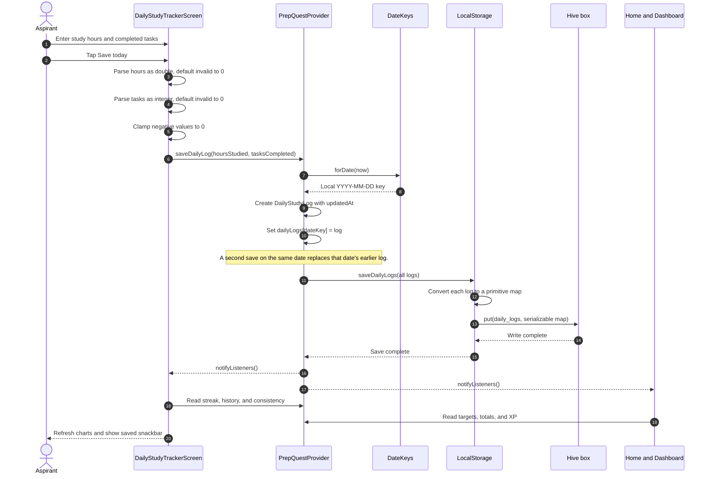
```mermaid
sequenceDiagram
    autonumber
    actor User as Aspirant
    participant UI as DailyStudyTrackerScreen
    participant Provider as PrepQuestProvider
    participant Date as DateKeys
    participant Store as LocalStorage
    participant Hive as Hive box
    participant Views as Home and Dashboard

    User->>UI: Enter study hours and completed tasks
    User->>UI: Tap Save today
    UI->>UI: Parse hours as double, default invalid to 0
    UI->>UI: Parse tasks as integer, default invalid to 0
    UI->>UI: Clamp negative values to 0
    UI->>Provider: saveDailyLog(hoursStudied, tasksCompleted)
    Provider->>Date: forDate(now)
    Date-->>Provider: Local YYYY-MM-DD key
    Provider->>Provider: Create DailyStudyLog with updatedAt
    Provider->>Provider: Set dailyLogs[dateKey] = log
    Note over Provider: A second save on the same date replaces that date's earlier log.
    Provider->>Store: saveDailyLogs(all logs)
    Store->>Store: Convert each log to a primitive map
    Store->>Hive: put(daily_logs, serializable map)
    Hive-->>Store: Write complete
    Store-->>Provider: Save complete
    Provider-->>UI: notifyListeners()
    Provider-->>Views: notifyListeners()
    UI->>Provider: Read streak, history, and consistency
    Views->>Provider: Read targets, totals, and XP
    UI-->>User: Refresh charts and show saved snackbar
```

### Daily entry normalization

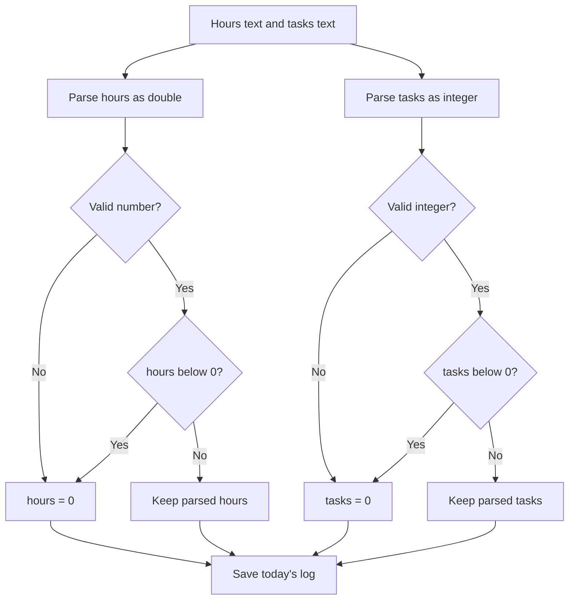
```mermaid
flowchart TD
    Input["Hours text and tasks text"] --> ParseH["Parse hours as double"]
    Input --> ParseT["Parse tasks as integer"]
    ParseH --> ValidH{"Valid number?"}
    ParseT --> ValidT{"Valid integer?"}
    ValidH -->|"No"| ZeroH["hours = 0"]
    ValidH -->|"Yes"| SignH{"hours below 0?"}
    SignH -->|"Yes"| ZeroH
    SignH -->|"No"| KeepH["Keep parsed hours"]
    ValidT -->|"No"| ZeroT["tasks = 0"]
    ValidT -->|"Yes"| SignT{"tasks below 0?"}
    SignT -->|"Yes"| ZeroT
    SignT -->|"No"| KeepT["Keep parsed tasks"]
    ZeroH --> Log["Save today's log"]
    KeepH --> Log
    ZeroT --> Log
    KeepT --> Log
```

---

## 12. Settings and reset sequences

### Username and theme changes

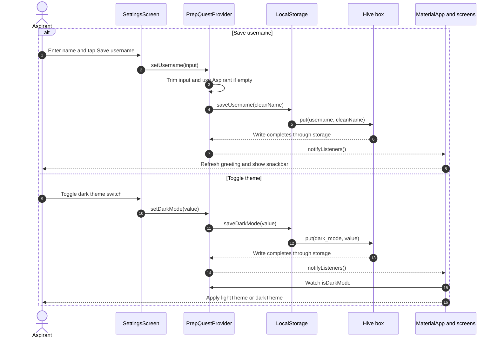
```mermaid
sequenceDiagram
    autonumber
    actor User as Aspirant
    participant UI as SettingsScreen
    participant Provider as PrepQuestProvider
    participant Store as LocalStorage
    participant Hive as Hive box
    participant App as MaterialApp and screens

    alt Save username
        User->>UI: Enter name and tap Save username
        UI->>Provider: setUsername(input)
        Provider->>Provider: Trim input and use Aspirant if empty
        Provider->>Store: saveUsername(cleanName)
        Store->>Hive: put(username, cleanName)
        Hive-->>Provider: Write completes through storage
        Provider-->>App: notifyListeners()
        App-->>User: Refresh greeting and show snackbar
    else Toggle theme
        User->>UI: Toggle dark theme switch
        UI->>Provider: setDarkMode(value)
        Provider->>Store: saveDarkMode(value)
        Store->>Hive: put(dark_mode, value)
        Hive-->>Provider: Write completes through storage
        Provider-->>App: notifyListeners()
        App->>Provider: Watch isDarkMode
        App-->>User: Apply lightTheme or darkTheme
    end
```

### Full-reset sequence

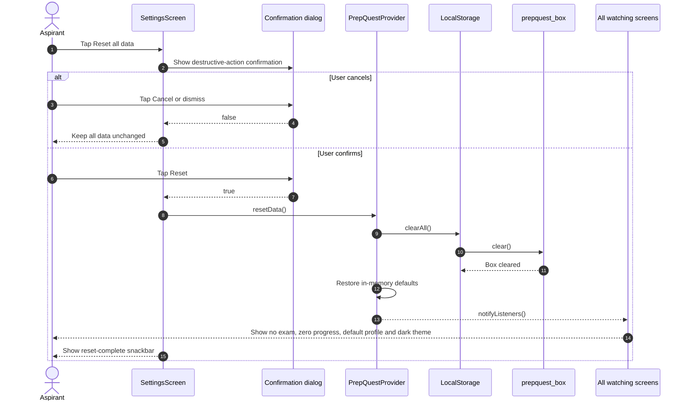
```mermaid
sequenceDiagram
    autonumber
    actor User as Aspirant
    participant UI as SettingsScreen
    participant Dialog as Confirmation dialog
    participant Provider as PrepQuestProvider
    participant Store as LocalStorage
    participant Hive as prepquest_box
    participant Views as All watching screens

    User->>UI: Tap Reset all data
    UI->>Dialog: Show destructive-action confirmation
    alt User cancels
        User->>Dialog: Tap Cancel or dismiss
        Dialog-->>UI: false
        UI-->>User: Keep all data unchanged
    else User confirms
        User->>Dialog: Tap Reset
        Dialog-->>UI: true
        UI->>Provider: resetData()
        Provider->>Store: clearAll()
        Store->>Hive: clear()
        Hive-->>Store: Box cleared
        Provider->>Provider: Restore in-memory defaults
        Provider-->>Views: notifyListeners()
        Views-->>User: Show no exam, zero progress, default profile and dark theme
        UI-->>User: Show reset-complete snackbar
    end
```

Reset clears the username, selected exam, theme preference, topic completion, and all daily logs. Consequently it also resets every derived value, including streak, totals, XP, and level.

---

## 13. Progress and analytics calculation flow

All analytics are getter-based projections of the currently loaded in-memory state; there is no separate analytics database.

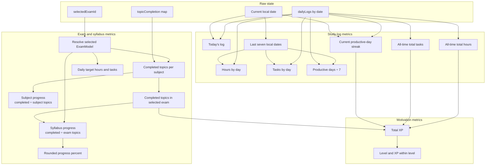
```mermaid
flowchart TB
    subgraph Raw["Raw state"]
        Exam["selectedExamId"]
        Completion["topicCompletion map"]
        Logs["dailyLogs by date"]
        Now["Current local date"]
    end

    subgraph ExamDerived["Exam and syllabus metrics"]
        Selected["Resolve selected ExamModel"]
        CompletedSubject["Completed topics per subject"]
        SubjectProgress["Subject progress\ncompleted ÷ subject topics"]
        CompletedAll["Completed topics in selected exam"]
        SyllabusProgress["Syllabus progress\ncompleted ÷ exam topics"]
        Percent["Rounded progress percent"]
        Targets["Daily target hours and tasks"]
    end

    subgraph LogDerived["Study-log metrics"]
        Today["Today's log"]
        Week["Last seven local dates"]
        WeekHours["Hours by day"]
        WeekTasks["Tasks by day"]
        Consistency["Productive days ÷ 7"]
        TotalHours["All-time total hours"]
        TotalTasks["All-time total tasks"]
        Streak["Current productive-day streak"]
    end

    subgraph Motivation["Motivation metrics"]
        XP["Total XP"]
        Level["Level and XP within level"]
    end

    Exam --> Selected
    Selected --> CompletedSubject
    Completion --> CompletedSubject
    CompletedSubject --> SubjectProgress
    CompletedSubject --> CompletedAll
    Selected --> SyllabusProgress
    CompletedAll --> SyllabusProgress --> Percent
    Selected --> Targets

    Logs --> Today
    Now --> Today
    Now --> Week
    Logs --> WeekHours
    Logs --> WeekTasks
    Week --> WeekHours
    Week --> WeekTasks
    Week --> Consistency
    Logs --> Consistency
    Logs --> TotalHours
    Logs --> TotalTasks
    Logs --> Streak
    Now --> Streak

    CompletedAll --> XP
    TotalHours --> XP
    TotalTasks --> XP
    Streak --> XP
    XP --> Level
```

### Dashboard projection

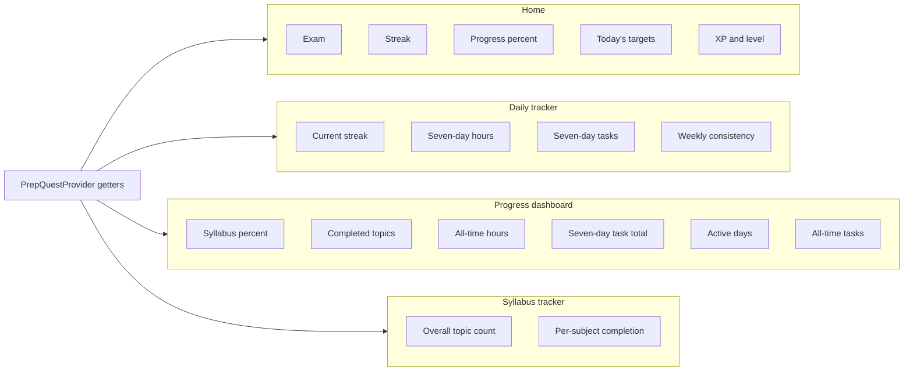
```mermaid
flowchart LR
    Provider["PrepQuestProvider getters"] --> Home
    Provider --> Daily
    Provider --> Progress
    Provider --> Syllabus

    subgraph Home["Home"]
        H1["Exam"]
        H2["Streak"]
        H3["Progress percent"]
        H4["Today's targets"]
        H5["XP and level"]
    end

    subgraph Daily["Daily tracker"]
        D1["Current streak"]
        D2["Seven-day hours"]
        D3["Seven-day tasks"]
        D4["Weekly consistency"]
    end

    subgraph Progress["Progress dashboard"]
        P1["Syllabus percent"]
        P2["Completed topics"]
        P3["All-time hours"]
        P4["Seven-day task total"]
        P5["Active days"]
        P6["All-time tasks"]
    end

    subgraph Syllabus["Syllabus tracker"]
        S1["Overall topic count"]
        S2["Per-subject completion"]
    end
```

---

## 14. Streak calculation flow

A productive day is any saved day where `hoursStudied > 0` **or** `tasksCompleted > 0`.

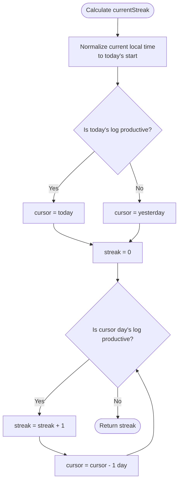
```mermaid
flowchart TD
    Start(["Calculate currentStreak"])
    Today["Normalize current local time\nto today's start"]
    ProductiveToday{"Is today's log productive?"}
    CursorToday["cursor = today"]
    CursorYesterday["cursor = yesterday"]
    Init["streak = 0"]
    ProductiveCursor{"Is cursor day's log productive?"}
    Increment["streak = streak + 1"]
    Previous["cursor = cursor - 1 day"]
    Return(["Return streak"])

    Start --> Today --> ProductiveToday
    ProductiveToday -->|"Yes"| CursorToday --> Init
    ProductiveToday -->|"No"| CursorYesterday --> Init
    Init --> ProductiveCursor
    ProductiveCursor -->|"Yes"| Increment --> Previous --> ProductiveCursor
    ProductiveCursor -->|"No"| Return
```

### Streak examples

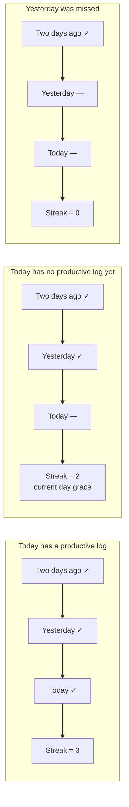
```mermaid
flowchart LR
    subgraph A["Today has a productive log"]
        A3["Two days ago ✓"] --> A2["Yesterday ✓"] --> A1["Today ✓"] --> AR["Streak = 3"]
    end

    subgraph B["Today has no productive log yet"]
        B3["Two days ago ✓"] --> B2["Yesterday ✓"] --> B1["Today —"] --> BR["Streak = 2\ncurrent day grace"]
    end

    subgraph C["Yesterday was missed"]
        C3["Two days ago ✓"] --> C2["Yesterday —"] --> C1["Today —"] --> CR["Streak = 0"]
    end
```

The current day does not break an existing streak before the day ends. Logging productive work today immediately extends it.

---

## 15. XP and level calculation flow

```mermaid
flowchart TD
    Topics["Completed topics\nin selected exam"] --> TopicXP["topics × 15"]
    Hours["All-time study hours"] --> HourXP["round(hours × 10)"]
    Tasks["All-time completed tasks"] --> TaskXP["tasks × 5"]
    Streak["Current streak"] --> StreakXP["streak × 20"]

    TopicXP --> Sum["totalXp = topic XP + hour XP + task XP + streak XP"]
    HourXP --> Sum
    TaskXP --> Sum
    StreakXP --> Sum

    Sum --> Level["level = floor(totalXp ÷ 250) + 1"]
    Sum --> Into["xpIntoLevel = totalXp mod 250"]
    Into --> Remaining["xpToNextLevel = 250 - xpIntoLevel"]
    Into --> Bar["levelProgress = xpIntoLevel ÷ 250"]
```

Because topic XP uses only the currently selected exam, changing exams can change the displayed XP. Because streak XP uses the current streak rather than a historical-best streak, displayed XP can also decrease when a streak expires.

---

## 16. Application architecture

### Layered component view

```mermaid
flowchart TB
    subgraph Presentation["Presentation layer"]
        App["PrepQuestApp\nMaterialApp and themes"]
        Shell["PrepQuestShell\nIndexedStack and bottom navigation"]
        Screens["Home · Exams · Syllabus · Daily\nDashboard · Settings"]
        Widgets["ExamCard · ProgressCard\nStreakCard · XpBar"]
    end

    subgraph StateLayer["State and application logic"]
        Provider["PrepQuestProvider\nChangeNotifier"]
        Derived["Derived getters\nprogress · targets · streak · totals · XP"]
    end

    subgraph Domain["Domain and configuration"]
        ExamModel["ExamModel · SubjectModel · TopicModel"]
        StudyLog["DailyStudyLog"]
        ExamData["Static ExamData catalog"]
        DateKeys["Local date-key utilities"]
    end

    subgraph Data["Data layer"]
        LocalStorage["LocalStorage"]
        Hive[("Hive dynamic box")]
    end

    App --> Shell --> Screens
    Screens --> Widgets
    Screens -->|"watch, read, command"| Provider
    Widgets -->|"display calculated values"| Provider
    Provider --> Derived
    Provider --> ExamModel
    Provider --> StudyLog
    ExamData --> Provider
    DateKeys --> Provider
    Provider --> LocalStorage --> Hive
```

### Reactive update path

```mermaid
sequenceDiagram
    participant User
    participant Widget as Interactive screen widget
    participant Provider as PrepQuestProvider
    participant Storage as LocalStorage and Hive
    participant Consumer as context.watch consumers

    User->>Widget: Perform an action
    Widget->>Provider: Invoke async state command
    Provider->>Provider: Update in-memory field or map
    Provider->>Storage: Await local persistence
    Storage-->>Provider: Write complete
    Provider-->>Consumer: notifyListeners()
    Consumer->>Provider: Read raw and derived getters again
    Consumer-->>User: Rebuild with current values
```

The implementation generally persists the mutation before notifying listeners. This keeps the reactive UI update aligned with a completed local write.

---

## 17. Data model

This is a conceptual entity view. Hive stores dynamic values and nested maps rather than separate relational tables.

```mermaid
erDiagram
    EXAM ||--|{ SUBJECT : contains
    SUBJECT ||--|{ TOPIC : contains
    TOPIC ||--o| TOPIC_COMPLETION : has
    LOCAL_STORE ||--o{ TOPIC_COMPLETION : persists
    LOCAL_STORE ||--o{ DAILY_STUDY_LOG : persists
    LOCAL_STORE ||--|| USER_PREFERENCES : persists
    EXAM ||--o| USER_PREFERENCES : selected_by

    EXAM {
        string id PK
        string title
        string shortTitle
        string description
        double dailyTargetHours
        int baseTargetTasks
    }

    SUBJECT {
        string id
        string title
        string examId FK
    }

    TOPIC {
        string id
        string title
        string subjectId FK
    }

    TOPIC_COMPLETION {
        string compositeKey PK
        boolean isComplete
    }

    DAILY_STUDY_LOG {
        string dateKey PK
        double hoursStudied
        int tasksCompleted
        datetime updatedAt
    }

    USER_PREFERENCES {
        string username
        string selectedExamId
        boolean darkMode
    }

    LOCAL_STORE {
        string boxName PK
    }
```

### Domain hierarchy

```mermaid
flowchart TD
    Catalog["ExamData.exams"]
    Catalog --> UPSC["UPSC\n5 subjects · 25 topics"]
    Catalog --> JPSC["JPSC\n4 subjects · 20 topics"]
    Catalog --> RBI["RBI Grade B\n4 subjects · 20 topics"]

    UPSC --> USubjects["Polity · History · Geography\nEconomy · Environment"]
    JPSC --> JSubjects["Jharkhand GK · Polity and Governance\nGeneral Studies · Language and Essay"]
    RBI --> RSubjects["Economic and Social Issues · Finance\nManagement · Phase 1 Aptitude"]

    USubjects --> UTopics["5 topics per subject"]
    JSubjects --> JTopics["5 topics per subject"]
    RSubjects --> RTopics["5 topics per subject"]
```

---

## 18. Local persistence layout

```mermaid
flowchart LR
    Box[("Hive box\nprepquest_box")]

    Box --> Username["username\nString\ndefault: Aspirant"]
    Box --> Exam["selected_exam_id\nString or absent"]
    Box --> Theme["dark_mode\nbool\ndefault: true"]
    Box --> Completion["topic_completion\nMap of composite key → bool"]
    Box --> Logs["daily_logs\nMap of date key → log map"]

    Logs --> DateKey["YYYY-MM-DD"]
    DateKey --> LogFields["dateKey\nhoursStudied\ntasksCompleted\nupdatedAt ISO-8601"]

    Completion --> Composite["examId.subjectId.topicId"]
```

### Serialization and restoration

```mermaid
flowchart TD
    Memory["Map of DailyStudyLog objects"] --> ToMap["DailyStudyLog.toMap for each entry"]
    ToMap --> Primitive["Map of primitive nested maps"]
    Primitive --> Hive["Hive put daily_logs"]

    Hive --> Raw["Dynamic map on next startup"]
    Raw --> Normalize["Convert dynamic keys to strings"]
    Normalize --> FromMap["DailyStudyLog.fromMap"]
    FromMap --> Memory2["Map of normalized DailyStudyLog objects"]

    BadNumbers["Unexpected numeric types or strings"] --> Coerce["Read as int/double or parse text; fallback 0"]
    InvalidDate["Invalid updatedAt text"] --> DateFallback["Fallback to current time"]
    EmptyKey["Empty dateKey"] --> Skip["Do not restore that log entry"]
```

---

## 19. Application state lifecycle

```mermaid
stateDiagram-v2
    [*] --> Bootstrapping
    Bootstrapping : Initialize Flutter and Hive
    Bootstrapping --> Loading
    Loading : Open box and restore provider fields
    Loading --> Ready

    state Ready {
        [*] --> NoExam
        NoExam : selectedExamId is null or unknown
        NoExam --> ExamActive : User selects a valid exam
        ExamActive --> ExamActive : User changes exam
        ExamActive --> NoExam : User confirms reset

        state ExamActive {
            [*] --> Tracking
            Tracking --> Tracking : Toggle syllabus topic
            Tracking --> Tracking : Save today's study log
            Tracking --> Reviewing : Open dashboard
            Reviewing --> Tracking : Return to a tracker
        }
    }

    Ready --> Ready : Change username or theme
    Ready --> Resetting : Confirm full reset
    Resetting --> Ready : Hive cleared and defaults restored
    Ready --> [*] : App process closes
```

The navigation index and active tracker tab are transient widget state; they are not persisted. A fresh process starts on Home and the Syllabus tracker tab.

---

## 20. Feature-to-code traceability

| Area | Main implementation | State or data source |
|---|---|---|
| Bootstrap | [`lib/main.dart`](lib/main.dart) | Hive initialization and provider load |
| App theme selection | [`lib/app.dart`](lib/app.dart) | `isDarkMode` |
| Navigation and Home | [`lib/screens/prepquest_shell.dart`](lib/screens/prepquest_shell.dart) | Provider getters |
| Exam selection | [`lib/screens/exam_selection_screen.dart`](lib/screens/exam_selection_screen.dart) | Static `ExamData` and `selectedExamId` |
| Syllabus tracker | [`lib/screens/syllabus_tracker_screen.dart`](lib/screens/syllabus_tracker_screen.dart) | `topicCompletion` map |
| Daily tracker | [`lib/screens/daily_study_tracker_screen.dart`](lib/screens/daily_study_tracker_screen.dart) | `dailyLogs` map and date utilities |
| Progress dashboard | [`lib/screens/progress_dashboard_screen.dart`](lib/screens/progress_dashboard_screen.dart) | Derived provider metrics |
| Settings and reset | [`lib/screens/settings_screen.dart`](lib/screens/settings_screen.dart) | Username, theme, and all persisted state |
| State and business rules | [`lib/providers/prepquest_provider.dart`](lib/providers/prepquest_provider.dart) | In-memory fields and calculated getters |
| Local persistence | [`lib/data/local/local_storage.dart`](lib/data/local/local_storage.dart) | Hive box `prepquest_box` |
| Exam domain model | [`lib/models/exam_model.dart`](lib/models/exam_model.dart) | Immutable exam hierarchy |
| Study-log model | [`lib/models/daily_study_log.dart`](lib/models/daily_study_log.dart) | Daily log serialization |
| Exam catalog | [`lib/core/constants/exam_data.dart`](lib/core/constants/exam_data.dart) | UPSC, JPSC, and RBI Grade B constants |
| Date windows and keys | [`lib/core/utils/date_keys.dart`](lib/core/utils/date_keys.dart) | Local calendar dates |

---

## 21. Rules, edge cases, and MVP boundaries

### Business rules

| Rule | Effect |
|---|---|
| Only one exam is active | Syllabus and topic-derived progress display for the selected exam only |
| Topic key includes exam, subject, and topic | Progress for different exams is retained independently when switching exams |
| Daily logs are keyed only by date | The same study history contributes regardless of which exam is currently active |
| Saving today replaces today's earlier entry | There is one aggregate log per local calendar day, not multiple sessions |
| Productive means hours > 0 or tasks > 0 | Either kind of effort counts for streak and active-day calculations |
| Current day has streak grace | An empty today does not break a streak that was active yesterday |
| Weekly consistency uses exactly seven dates | Productive days in the local last-seven-day window are divided by 7 |
| Daily target progress caps at 100% | Extra study is retained in totals, but the target bar does not exceed full |
| XP has 250 points per level | Level numbering begins at 1 |
| Empty username becomes `Aspirant` | Whitespace is trimmed before persistence |
| Reset clears the entire Hive box | Raw and derived progress both return to defaults |

### Current MVP boundaries

```mermaid
flowchart LR
    subgraph Included["Implemented now"]
        I1["Offline local use"]
        I2["Three static exam plans"]
        I3["Topic checklist"]
        I4["One aggregate daily entry"]
        I5["Seven-day and all-time summaries"]
        I6["Streak, XP, and levels"]
        I7["Local profile and theme"]
    end

    subgraph NotIncluded["Outside the current MVP"]
        N1["Login and user accounts"]
        N2["Cloud backup or synchronization"]
        N3["Server or API integration"]
        N4["Custom exams, subjects, or topics"]
        N5["Multiple study sessions per day"]
        N6["Notifications or study reminders"]
        N7["Social, sharing, or leaderboards"]
        N8["Historical streak-best tracking"]
    end

    Included -. "possible future expansion" .-> NotIncluded
```

### Important interpretation notes

- `isLoaded` is set during provider restoration but the app waits for `load()` before `runApp`, so users do not see an intermediate loading screen.
- A stored exam ID that is absent from the static catalog behaves like no exam selected because `ExamData.byId` returns `null`.
- Topic completion records are stored for both `true` and `false` values instead of removing unchecked keys.
- Dashboard charts use the exam's target hours as their initial vertical maximum, then expand if any recorded day exceeds it.
- `totalHours` and `totalTasks` include every restored daily log, while the charts and weekly consistency use only the last seven local dates.
- The app has no network dependency in its application code, making restored Hive state the source of truth between launches.

---

## Diagram coverage summary

```mermaid
flowchart LR
    Requirements["User needs"] --> Stories["User-story map"]
    Stories --> Journey["User journey"]
    Journey --> Navigation["Navigation and workflows"]
    Navigation --> Sequences["Interaction sequences"]
    Sequences --> Architecture["Components and state"]
    Architecture --> Data["Models and persistence"]
    Data --> Rules["Metrics, rules, and edge cases"]
```

Together, these views describe what PrepQuest does, how an aspirant moves through it, how each state mutation is processed, how local data is structured, and how visible progress is derived.
